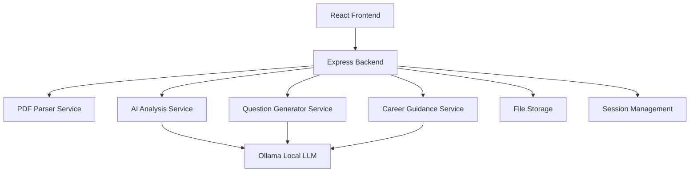

# Design Document

## Overview

The Resume Analyzer is a full-stack web application that processes PDF resumes locally using AI to generate personalized interview questions and career guidance. The system uses a React.js frontend with a Node.js/Express backend, integrating with Ollama for local AI processing to ensure privacy and data security.

## Architecture

### High-Level Architecture



### Technology Stack

**Frontend:**
- React.js 18+ with TypeScript
- Material-UI or Tailwind CSS for styling
- React Query for state management and caching
- Axios for API communication
- React Dropzone for file uploads

**Backend:**
- Node.js with Express.js
- TypeScript for type safety
- Multer for file upload handling
- PDF parsing with pdf-parse or pdf2pic + Tesseract OCR
- Ollama integration for local AI processing
- Winston for logging

**AI/ML:**
- Ollama with models like Llama 2, Code Llama, or Mistral
- Local model execution for privacy
- Structured prompting for consistent outputs

## Components and Interfaces

### Frontend Components

#### 1. App Component
- Main application wrapper
- Routing and navigation
- Global state management

#### 2. Upload Component
- Drag-and-drop file upload interface
- File validation (PDF format, size limits)
- Upload progress indicators
- Error handling for invalid files

#### 3. Configuration Component
- Question quantity settings (1-50 for technical and HR)
- Difficulty level selection (Beginner, Intermediate, Advanced, Mixed)
- Processing preferences

#### 4. Analysis Dashboard
- Resume parsing results display
- Extracted skills and experience visualization
- Processing status and progress

#### 5. Questions Component
- Generated interview questions display
- Categorized by type (technical/behavioral)
- Difficulty indicators
- Answer framework suggestions

#### 6. Guidance Component
- Career roadmap visualization
- Skill gap analysis
- Learning recommendations with resources

#### 7. Export Component
- PDF/text export functionality
- Customizable report generation

### Backend Services

#### 1. File Upload Service
```typescript
interface FileUploadService {
  uploadResume(file: Express.Multer.File): Promise<UploadResult>
  validateFile(file: Express.Multer.File): ValidationResult
  cleanupTempFiles(): Promise<void>
}
```

#### 2. PDF Parser Service
```typescript
interface PDFParserService {
  extractText(filePath: string): Promise<ExtractedContent>
  extractStructure(filePath: string): Promise<ResumeStructure>
  handleOCR(filePath: string): Promise<string>
}
```

#### 3. AI Analysis Service
```typescript
interface AIAnalysisService {
  analyzeResume(content: ExtractedContent): Promise<ResumeAnalysis>
  extractSkills(content: string): Promise<SkillSet>
  determineSeniority(experience: ExperienceSection[]): Promise<SeniorityLevel>
}
```

#### 4. Question Generator Service
```typescript
interface QuestionGeneratorService {
  generateTechnicalQuestions(
    skills: SkillSet, 
    count: number, 
    difficulty: DifficultyLevel
  ): Promise<Question[]>
  generateBehavioralQuestions(
    experience: ExperienceSection[], 
    count: number
  ): Promise<Question[]>
}
```

#### 5. Career Guidance Service
```typescript
interface CareerGuidanceService {
  generateRoadmap(analysis: ResumeAnalysis): Promise<CareerRoadmap>
  identifySkillGaps(currentSkills: SkillSet, targetRole: string): Promise<SkillGap[]>
  recommendResources(skillGaps: SkillGap[]): Promise<LearningResource[]>
}
```

## Data Models

### Core Data Types

```typescript
interface ResumeAnalysis {
  id: string
  fileName: string
  uploadedAt: Date
  personalInfo: PersonalInfo
  experience: ExperienceSection[]
  education: EducationSection[]
  skills: SkillSet
  projects: ProjectSection[]
  seniorityLevel: SeniorityLevel
  careerSummary: string
}

interface SkillSet {
  technical: TechnicalSkill[]
  soft: SoftSkill[]
  languages: ProgrammingLanguage[]
  frameworks: Framework[]
  tools: Tool[]
}

interface TechnicalSkill {
  name: string
  category: string
  proficiencyLevel: 'Beginner' | 'Intermediate' | 'Advanced'
  yearsOfExperience?: number
}

interface Question {
  id: string
  type: 'technical' | 'behavioral'
  difficulty: DifficultyLevel
  question: string
  category: string
  suggestedAnswerFramework?: string
  relatedSkills: string[]
}

interface CareerRoadmap {
  currentLevel: SeniorityLevel
  recommendedPath: RoadmapStep[]
  skillGaps: SkillGap[]
  timelineEstimate: string
}

interface RoadmapStep {
  title: string
  description: string
  skills: string[]
  estimatedTime: string
  priority: 'High' | 'Medium' | 'Low'
  resources: LearningResource[]
}
```

### Configuration Types

```typescript
interface QuestionConfig {
  technicalCount: number // 1-50
  behavioralCount: number // 1-50
  difficulty: DifficultyLevel
}

type DifficultyLevel = 'Beginner' | 'Intermediate' | 'Advanced' | 'Mixed'
```

## Error Handling

### Frontend Error Handling
- Global error boundary for React components
- Toast notifications for user-friendly error messages
- Retry mechanisms for failed API calls
- Graceful degradation for non-critical features

### Backend Error Handling
- Centralized error middleware
- Structured error responses with appropriate HTTP status codes
- File cleanup on processing failures
- Comprehensive logging for debugging

### Error Types
```typescript
enum ErrorType {
  FILE_UPLOAD_ERROR = 'FILE_UPLOAD_ERROR',
  PDF_PARSING_ERROR = 'PDF_PARSING_ERROR',
  AI_PROCESSING_ERROR = 'AI_PROCESSING_ERROR',
  VALIDATION_ERROR = 'VALIDATION_ERROR',
  OLLAMA_CONNECTION_ERROR = 'OLLAMA_CONNECTION_ERROR'
}
```

## Testing Strategy

### Frontend Testing
- Unit tests for components using Jest and React Testing Library
- Integration tests for user workflows
- Visual regression tests for UI consistency
- Accessibility testing with axe-core

### Backend Testing
- Unit tests for services and utilities
- Integration tests for API endpoints
- End-to-end tests for complete workflows
- Performance tests for file processing

### AI/ML Testing
- Prompt validation and consistency tests
- Output quality assessment with sample resumes
- Performance benchmarks for different model sizes
- Fallback testing when Ollama is unavailable

### Test Coverage Goals
- Minimum 80% code coverage for critical paths
- 100% coverage for data validation functions
- Comprehensive error scenario testing

## Performance Considerations

### Frontend Optimization
- Code splitting and lazy loading for components
- Memoization for expensive computations
- Optimized bundle size with tree shaking
- Progressive loading for large result sets

### Backend Optimization
- Streaming for large file uploads
- Background processing for AI analysis
- Connection pooling for Ollama requests
- Efficient memory management for PDF processing

### Caching Strategy
- Browser caching for static assets
- Session-based caching for analysis results
- Memoization of AI model responses for similar inputs

## Security Considerations

### Data Privacy
- All processing happens locally (no external API calls)
- Temporary file cleanup after processing
- Session-based data storage (no persistent user data)
- Optional secure deletion of processed files

### Input Validation
- File type and size validation
- Content sanitization for extracted text
- Rate limiting for API endpoints
- CSRF protection for file uploads

### Ollama Security
- Local model execution only
- Input sanitization for AI prompts
- Resource limits for model inference
- Secure model file storage

## Deployment and Infrastructure

### Local Development
- Docker Compose for consistent development environment
- Hot reloading for both frontend and backend
- Automated Ollama model setup
- Development database seeding

### Production Deployment
- Standalone executable with embedded models
- Cross-platform compatibility (Windows, macOS, Linux)
- Automated installer with dependency management
- Configuration management for different environments